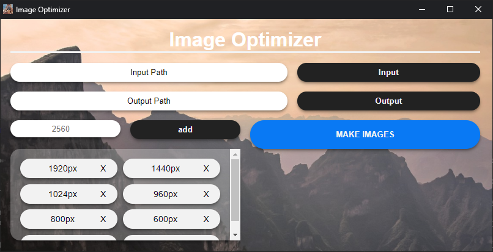

# Image-Optimizer



## Download and Install


```shell
git clone https://github.com/stefankumpan/Image-Optimizer-Script.git
```

```shell
cd Image-Optimizer-Script
```

```shell
pip install -r requirements.txt
```

## GUI
Windows:
```shell
python app.py
```

MacOS & Linux:
```shell
python3 app.py
```

## Use Script 
Windows:
```shell
python main.py
```

MacOS & Linux:
```shell
python3 main.py
```


The optimized images are then located in the output directory


